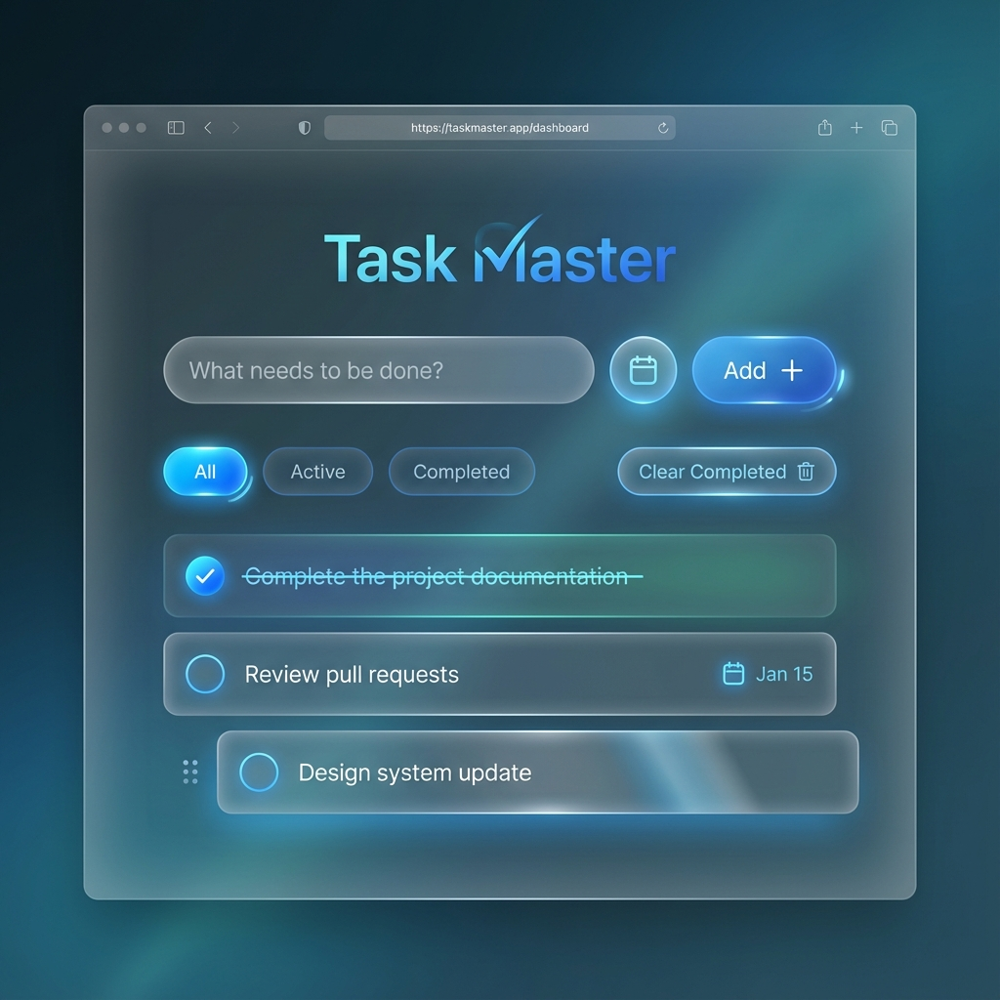

# Task Manager

A premium, dynamic task management application built with Vite and Vanilla JavaScript.

## Features

- **Rich Aesthetics**: Glassmorphism design with smooth animations.
- **Task Management**: Add, edit, and delete tasks easily.
- **Local Storage**: Your tasks are saved automatically.
- **Responsive**: Works beautifully on all devices.
- **Live Demo / Algo**: [Task Manager Repository](https://github.com/Raphasha27/task_manager)

## Getting Started

1.  Clone the repository.
2.  Run `npm install` to install dependencies.
3.  Run `npm run dev` to start the local server.
4.  Open your browser to the local server URL.

## Technologies

- HTML5
- CSS3 (Vanilla)
- JavaScript (ES6+)
- Vite
