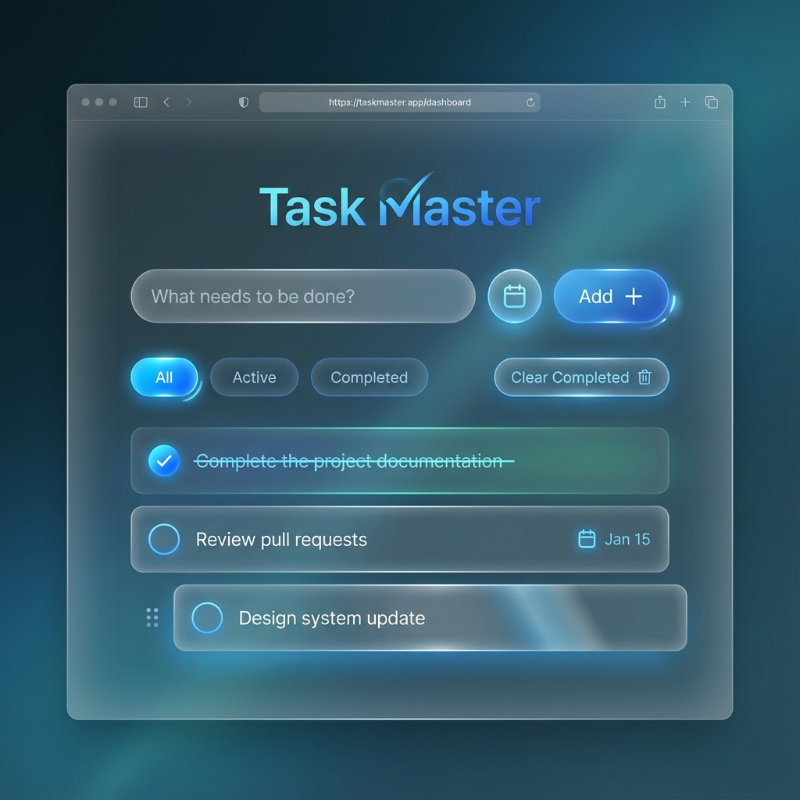

# Task Master — AI Edition


A premium glassmorphism task management app with built-in per-task timers, drag-and-drop reordering, and an AI productivity assistant panel that provides contextual suggestions based on your task list.



## Features

- **Task CRUD** — Add, edit (double-click), complete, and delete tasks
- **Due Dates** — Attach optional dates via the calendar picker
- **Per-Task Timer** — Start/stop a running timer per task; auto-stops others when a new timer starts
- **Drag & Drop** — Reorder tasks by dragging; order is saved to localStorage
- **Filters** — All / Active / Completed tabs
- **AI Insights Panel** — Click "AI Tips" to get generated suggestions based on task keywords and workload (e.g., "You have a lot on your plate", design/bug/write tips)
- **Glassmorphism UI** — Dark gradient background, glass-panel container, neon accents
- **Persistence** — All data saved to `localStorage`

## Getting Started

```bash
npm install
npm run dev
```

Open the URL shown in the terminal (default `http://localhost:5173`).

## Build

```bash
npm run build
npm run preview
```

## Tech Stack

- **Vite 6** — fast dev server and build
- **Vanilla JS (ES Modules)** — no framework
- **CSS3** — glassmorphism, custom properties, animations
- **localStorage** — client-side persistence

## Project Structure

```
task_manager/
├── index.html          # Entry HTML
├── main.js             # App logic (state, render, timer, AI)
├── style.css           # All styles
├── package.json
├── screenshot.png
├── src/                # Vite scaffold
└── .github/            # CI, issue templates, dependabot
```

## License

MIT — see [LICENSE](./LICENSE).
